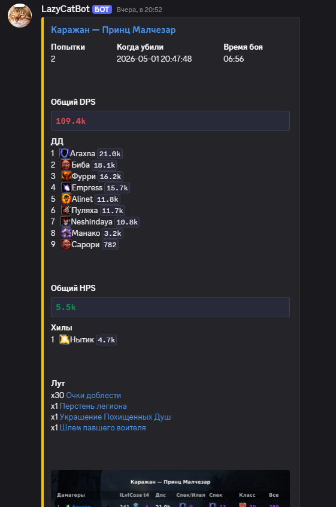
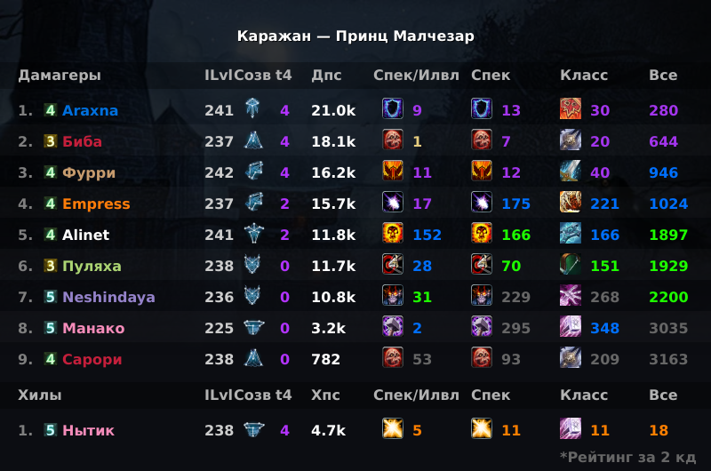
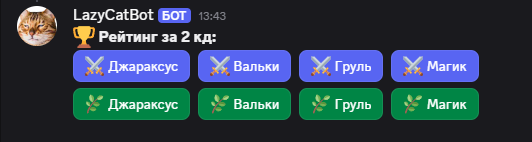
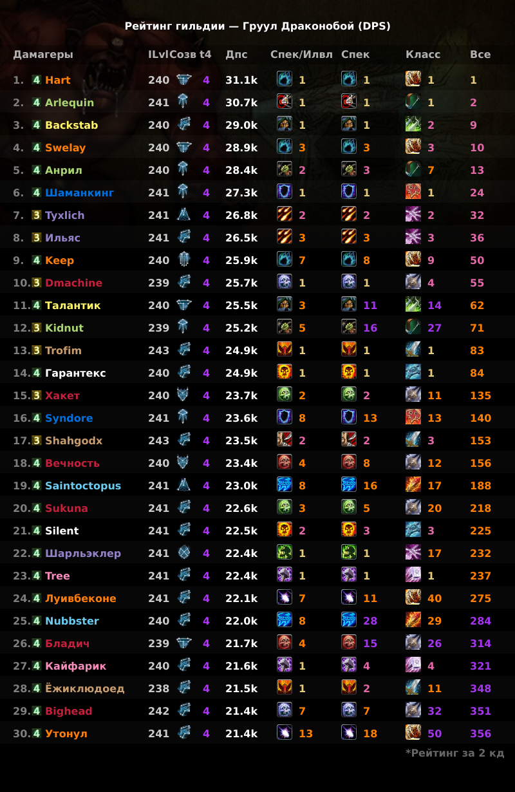

# 🐈 LazyCatBot — Твой помощник в мире Sirus.su
Дискорд бот для отслеживания новых убийств боссов вашей гильдией и не только
---
## 🚀 Быстрый старт
### 1. Добавление бота
Чтобы добавить бота на свой сервер, перейдите по ссылке ниже и выберите нужный сервер:
👉 **[ДОБАВИТЬ LAZYCATBOT НА СЕРВЕР](https://discord.com/oauth2/authorize?client_id=1493704685297602731&permissions=277092879552&integration_type=0&scope=bot+applications.commands)**
> **Важно:** Для корректной работы боту требуются права на чтение сообщений, отправку сообщений и вставку ссылок (Embed Links).
### 2. Настройка канала
1. Создайте текстовый канал (например, `#raid-alerts`).
2. В этом канале введите команду `/set id_гильдии`.
   * *Например:* `/set 1234`
3. Бот сразу начнет мониторинг! Если бот начал отправлять килы гильдии за текущее кд, значит все ок и бот работает.
---
## ✨ Возможности
### 📊 Красивые отчеты об убийствах
Бот присылает детальный отчет сразу после убийства босса. В отчете указаны время, сложность и основные данные боя.

### 🏆 Списки лучших игроков
Следите за эффективностью ваших рейдеров. Бот формирует рейтинги по DPS и HPS для каждого сражения.

### 🏆 Рейтинг по "замерным" босам среди игроков гильдии по дпс/хпс

Команда /topm вызывает меню с кнопками, после нажатия на которые бот отправляет отчет топ 30 игроков гильдии по выбранному босу, с дпс или хпс среди игроков гильдии

(кнопки можно закрепть в канале для удобвства, взаимодействовать с ними могут все, первый ряд дпс, второй ряд хпс)

---
## 🛠️ Команды бота
| Команда | Описание |
| :--- | :--- |
| `/set ID` | Подписаться на отчеты гильдии в текущем канале |
| `/unset ID` | Удалить подписку гильдии в текущем канале |
| `/menu` | Вызывает меню с настройкой подписок бота, трекинга и т.д. |
| `/topm` | Команда вызывает меню с кнопками, который видят все, нажав на которые можно отправить рейтинги по "чек" босам среди игроков гильдии |
| `/setcat ник_игрока` | Подписаться на отчеты конкретного игрока |
| `/unsetcat ID_игрока` | Отписаться от отчетов конкретного игрока |
| `/list` | Показать список всех подписок в канале |
| `/help` | Справка по командах и ссылка на поддержку |
больше комманд можно посмотреть в самом боте, введите / в текстовом канале дискорда куда добавлен бот
---
## ❓ Часто задаваемые вопросы
**Где взять ID гильдии?**
1. Зайдите на сайт [Sirus.su](https://sirus.su).
2. Найдите свою гильдию в базе данных.
3. ID — это число в конце ссылки. Например, в ссылке `sirus.su/base/guild/x3/1234` ID будет `1234`.
**Бот не присылает отчеты, что делать?**
Проверьте, есть ли у бота права на просмотр данного канала и на отправку сообщений (Embed). Также убедитесь, что вы использовали команду `/set` именно в том канале, куда должны приходить отчеты.
